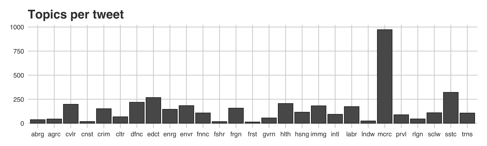
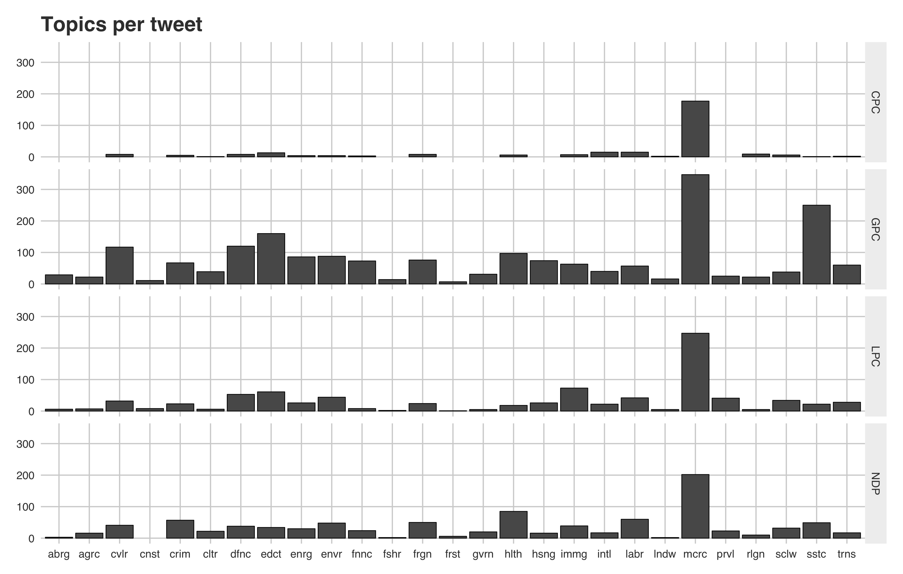
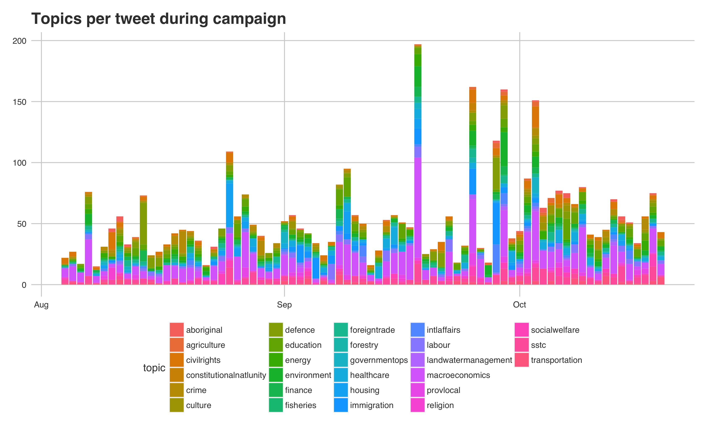
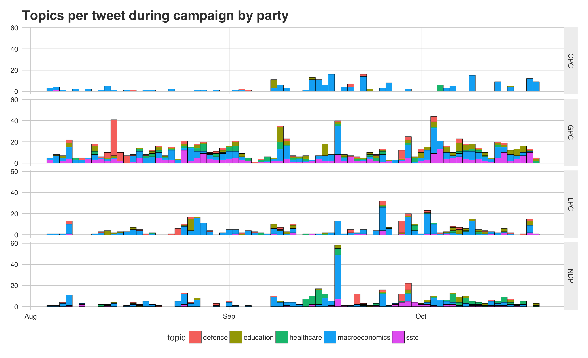

# Party Strategies of the 2015 Canadian Federal Campaign
Topic and sentiment analysis of the 2015 Canadian Federal Campaign.

## Canadian Television Ads Analysis

## Topics used by Canadian Political Parties on Twitter

## Topics by party

## Topics per tweet

## Top 5 topics per tweet by party

